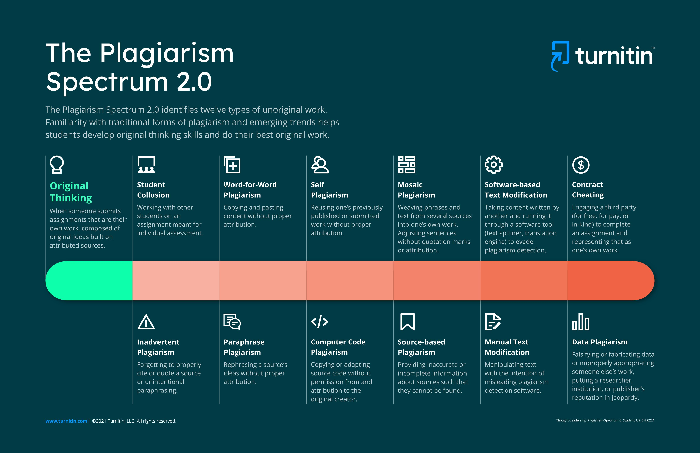
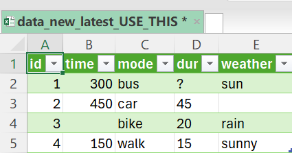

# Ethics {#ethics}

##  Plagiarism  {#ethics1}


*Plagiarism* refers to the use of someone else’s work, ideas, or expressions without proper acknowledgment, presenting them as one’s own. According to the Turnitin Plagiarism Spectrum 2.0, plagiarism is not a single act but a range of practices that vary in intent and severity. Understanding these types helps students develop academic integrity and proper research practices [66].

{width="80%" height="120%" fig-align="center"}

At one end of the spectrum is original thinking, which represents authentic work based on one’s own ideas, properly supported by sources. This is the expected standard in academic writing and emphasizes independent analysis and correct citation [66][67].

Several forms of plagiarism involve direct copying. **Word-for-word plagiarism** occurs when text is copied exactly without quotation marks or citation. This is one of the most obvious and serious violations. Similarly, **mosaic plagiarism** (also known as *patchwriting*) involves combining text from multiple sources without proper attribution, creating a misleading impression of originality [66][68].

Another common category is **paraphrasing plagiarism**, where a source is reworded but not properly cited. Even if the wording is changed, failing to credit the original source still constitutes plagiarism. Closely related is **inadvertent plagiarism**, which occurs when students unintentionally fail to cite sources correctly or misunderstand citation rules. While less intentional, it still undermines academic integrity [66][67].

**Self-plagiarism** occurs when individuals reuse their own previously submitted or published work without acknowledgment. Although the work is their own, academic standards typically require originality for each submission, making this practice problematic [66].

Some types of plagiarism involve collaboration or misrepresentation. **Student collusion** happens when students work together on assignments meant to be completed individually. **Contract cheating** is a more serious form, where someone else completes the work (e.g., hiring a third party), and the student submits it as their own [66][68].

There are also forms related to data and sources. **Data plagiarism** involves using data without proper attribution or permission, which can damage the credibility of research. **Source-based plagiarism** occurs when sources are misrepresented, fabricated, or incorrectly cited, making it difficult or impossible to verify the information [66][67].

In technical and digital contexts, plagiarism can take additional forms. **Computer code plagiarism** involves copying or adapting code without permission or attribution. **Manual text modification** includes altering text (e.g., replacing words or characters) to avoid plagiarism detection tools without genuinely changing the content. Similarly, **software-based text modification** uses automated tools (such as paraphrasing software) to disguise copied content [66][68].

Overall, plagiarism ranges from unintentional mistakes to deliberate academic misconduct. Recognizing these different forms is essential for maintaining academic honesty, credibility, and ethical research practices [67].

**Reflection Questions**

1. *Why is plagiarism considered unethical in academic work?*
2. *What is the difference between paraphrasing and paraphrasing plagiarism?*
3. *Can self-plagiarism be considered misconduct? Why or why not?*
4. *How can technology both help and encourage plagiarism?*
5. *Which type of plagiarism do you think is the hardest to detect and why?*

**Exercises**

```{r quiz11-setup, include = FALSE}
library(exams)
library(exams2forms)

exercise_directory <- file.path("exams", "exercises")
quiz_plagiarism <- list(
  file.path(exercise_directory, "plag-base.Rmd"),
  file.path(exercise_directory, "word-plag.Rmd"),
  file.path(exercise_directory, "mosa-plag.Rmd"),
  file.path(exercise_directory, "para-plag.Rmd"),
  file.path(exercise_directory, "self-plag.Rmd"),
  file.path(exercise_directory, "contr-cheat.Rmd"),
  file.path(exercise_directory, "data-plag.Rmd"),
  file.path(exercise_directory, "source-plag.Rmd"),
  file.path(exercise_directory, "text-mod.Rmd"),
  file.path(exercise_directory, "orig-think.Rmd")
)
```

```{r quiz11, echo = FALSE, message = FALSE, results = "asis"} 
exams2forms(quiz_plagiarism, solution = TRUE)
```

**Practical Exercise**

*You’ve retrieved the following paragraph from an academic source and would like to use this information in your own research paper / student report. Which of the three provided versions will be acceptable? Explain why.*


**Original Text:**

> Plagiarism is not limited to copying text word for word. It also includes paraphrasing ideas without proper attribution, reusing one’s own previous work without disclosure, and manipulating sources so that they cannot be traced. Even unintentional mistakes can undermine academic integrity and damage trust in scholarly communication.

```{r test-setup, include = FALSE}
library(exams)
library(exams2forms)

exercise_directory <- file.path("exams", "exercises")
test_plagiarism <- list(
  file.path(exercise_directory, "prac-plag-11.Rmd"),
  file.path(exercise_directory, "prac-plag-22.Rmd"),
  file.path(exercise_directory, "prac-plag-33.Rmd")
)

```

```{r test, echo = FALSE, message = FALSE, results = "asis"} 
#exams2forms(exm, n = 3)
exams2forms(test_plagiarism, solution = TRUE)
```


## AI Tools in Education  {#ethics2}

The rapid adoption of artificial intelligence (AI), particularly large language models (LLMs), has significantly transformed higher education. Recent studies estimate that between 43% and over 70% of U.S. college students have used AI tools in their academic work [24][25]. This widespread usage reflects the growing accessibility of tools such as ChatGPT and similar systems, which can assist with writing, coding, and data analysis.

At the same time, the expansion of AI in education has sparked intense debates around ethics, academic integrity, and institutional policies [26][27]. Universities are still adapting: for example, institutions like TU Dresden have not yet established clear, comprehensive policies defining acceptable AI use: it’s up to the Chair to decide whether and to ehat limits AI usage is permitted in the educational process. Research shows that faculty adoption of AI increased from 22% to 40% between 2023 and 2024 [28]. Interestingly, instructors who use AI themselves are more likely to regulate its use rather than ban it outright, suggesting a shift toward integration rather than prohibition.

AI tools offer several important benefits in education. One key advantage is efficiency: AI can significantly reduce time spent on repetitive tasks, such as formatting references, generating visualizations, or summarizing literature. This allows students and researchers to focus more on critical thinking and conceptual work. Moreover, many academic publishers and high-impact journals now allow the use of AI tools if their use is transparently disclosed, reinforcing the importance of ethical and responsible use [29].

AI also plays a major role in enhancing accessibility and inclusivity. Tools such as AI tutors, learning management systems (LMS), and language-support applications help diverse groups of learners. These include students with disabilities, as well as those studying in a second language, by providing personalized explanations, translations, and adaptive learning paths [30][31][32]. In this way, AI contributes to more equitable access to education.

However, the use of AI also presents significant risks and challenges. One major issue is the phenomenon of **AI hallucinations**, where systems generate incorrect or misleading information with high confidence. Additionally, AI models may reflect biases present in their training data, potentially reinforcing stereotypes or producing unfair outcomes. There is also concern about the possibility of harmful or inappropriate advice, especially when users rely on AI without critical evaluation [33].

Another critical issue is the impact of AI on learning processes and cognitive development. Studies suggest that students may overtrust AI-generated content, reducing their engagement with material and limiting the development of essential academic skills such as critical thinking and problem-solving [33][34]. Some researchers argue that heavy reliance on AI could lead to a decline in cognitive effort and academic performance, raising concerns about long-term learning outcomes.

Finally, broader concerns relate to the future of education itself. Critics highlight potential tensions between innovation-driven education and humanistic values, including originality, creativity, and intellectual independence [35]. There are also concerns about a possible decline in the quality and credibility of academic degrees if AI use is not properly regulated and integrated [36].

In conclusion, AI tools in education offer powerful opportunities to improve efficiency, accessibility, and innovation. However, they also require careful regulation, ethical awareness, and critical use to ensure that they support rather than undermine learning.

**Reflection Questions**

1. *What are the main benefits of AI tools for students and educators?*
2. *Why might universities hesitate to fully allow or fully ban AI tools?*
3. *How can AI improve accessibility in education? Provide examples.*
4. *What are the risks of over-relying on AI tools?*
5. *How can students use AI responsibly without committing academic misconduct?*


**Exercises**

```{r quiz22-setup, include = FALSE}
library(exams)
library(exams2forms)

exercise_directory <- file.path("exams", "exercises")
quiz_ai <- list(
  file.path(exercise_directory, "ai-perk.Rmd"),
  file.path(exercise_directory, "ai-hallu.Rmd"),
  file.path(exercise_directory, "ai-uni.Rmd"),
  file.path(exercise_directory, "ai-risk.Rmd"),
  file.path(exercise_directory, "ai-access.Rmd"),
  file.path(exercise_directory, "ai-publi.Rmd"),
  file.path(exercise_directory, "ai-regul.Rmd"),
  file.path(exercise_directory, "ai-concern.Rmd")
)
```

```{r quiz22, echo = FALSE, message = FALSE, results = "asis"} 
exams2forms(quiz_ai, solution = TRUE)
```


## Unethical Research Practices  {#ethics3}

Sound scientific research relies on rigorous methodology, transparency, and correct statistical reasoning. As discussed in earlier lessons, statistical significance cannot be established by applying a single test in isolation; instead, proper hypothesis testing must be conducted using appropriate methods such as t-tests, ANOVA, or regression analysis [69][70].

One commonly used approach is null hypothesis significance testing (NHST), particularly the p-value method. The **p-value represents** the probability of observing results at least as extreme as those obtained, assuming the null hypothesis is true. Researchers typically compare the p-value to a predefined significance level (commonly 0.05) to decide whether to reject the null hypothesis [69]. However, the p-value has been widely criticized for being misinterpreted and misused, prompting recommendations to complement or replace it with alternatives such as confidence intervals or Bayesian methods [71].

A major concern in modern research is the prevalence of **questionable research practices (QRPs),** especially those that artificially produce statistically significant results. These practices are often grouped under the term **p-hacking**, which refers to manipulating data analysis until a desired (significant) result is obtained [72]. Such practices increase the likelihood of false positives (Type I errors) and contribute to the broader replication crisis in science [73].

Several common forms of unethical or poor research practices include:

-   **Data Trimming** (Selective Removal of Data). This involves removing data points—often labeled as “outliers”—without proper justification to achieve significance. While legitimate outlier removal is sometimes necessary, it must follow predefined, transparent criteria [70].

-   **Data Peeking** (Optional Stopping). Researchers repeatedly test their hypothesis during data collection and stop once significance is reached. This inflates the probability of false positives because the stopping rule is influenced by the observed results [72].

-   **Variable Manipulation** (HARKing and Outcome Switching). Researchers may:
- 	Focus only on subgroups where results are significant;
- 	Change the primary outcome variable during analysis;
- 	Formulate hypotheses after seeing the results (*HARKing:* Hypothesizing After Results are Known)..
These practices introduce bias and undermine the validity of conclusions [73].

-   **Multiple Testing (Multiple Comparisons Problem).** Conducting many statistical tests increases the probability of finding at least one significant result by chance. Without correction methods (e.g., Bonferroni correction), this leads to misleading conclusions [69][70].

-  **Excessive Model Fitting (Overfitting)**. Researchers may test multiple models and selectively report those that produce significant results. This leads to models that fit the sample data well but fail to generalize to new data [70].

-  **Misleading Data Visualization**
Even when statistical methods are applied correctly, poor or manipulative visualization can distort interpretation:
- 	Using percentages instead of absolute values to exaggerate findings
- 	Scale manipulation (e.g., axes not starting at zero)
- 	Concealing variation by combining incompatible scales
- 	Changing axis proportions to exaggerate or minimize trends
These practices can mislead audiences and are considered unethical when used intentionally [74].

-  **Lack of Transparency and Reproducibility**
Modern research ethics emphasize open science practices, including:
-   sharing data and code
- 	preregistering studies
- 	clearly documenting methods
Failure to do so can make results difficult to verify and may hide questionable practices [73].

**Reflection Questions**

1.	*Why is p-hacking dangerous for scientific research?*
2.	*What is the difference between legitimate data cleaning and unethical data trimming?*
3.	*How does multiple testing increase the risk of false positives?*
4.	*Why is preregistration important in research?*
5.	*Can misleading visualizations be as harmful as incorrect statistical analysis? Why?*

**Exercises**

```{r quiz33-setup, include = FALSE}
library(exams)
library(exams2forms)

exercise_directory <- file.path("exams", "exercises")
quiz_misconduct <- list(
  file.path(exercise_directory, "p-hack.Rmd"),
  file.path(exercise_directory, "type1-err.Rmd"),
  file.path(exercise_directory, "data-peek.Rmd"),
  file.path(exercise_directory, "hark.Rmd"),
  file.path(exercise_directory, "multi-comp.Rmd"),
  file.path(exercise_directory, "overfit.Rmd"),
  file.path(exercise_directory, "p-crit.Rmd"),
  file.path(exercise_directory, "vis-mislead.Rmd"),
  file.path(exercise_directory, "res-trans.Rmd"),
  file.path(exercise_directory, "ethic-meth.Rmd")
)
```

```{r quiz33, echo = FALSE, message = FALSE, results = "asis"} 
exams2forms(quiz_misconduct, solution = TRUE)
```


## Finding Reliable Sources  {#ethics4}

Quality of any research highly depends on the quality of used data. Unless primary data is used, data sources should be critically assessed before retrieving any information. 

A key principle is *to prioritize academic and peer-reviewed literature* over less reliable sources such as newspapers, blogs, or social media. Peer-reviewed publications undergo rigorous evaluation by experts before publication, ensuring a higher level of credibility and methodological soundness [76]. Common platforms for finding such literature include Scopus, ResearchGate, and Elsevier databases. 

Also, *using appropriate filters* can make search more precise and easy: select or sort search results based on the discipline, type of publication (book, conference paper, article), relevancy, number of citations and so on. Use logical operators (AND, OR; etc.) to navigate between subjects. 

Another important factor is *publication quality and status:* when in doubt, give preference to the newer publications, especially in emerging fields. This does not apply to preprints, which are often recent, but has not been yet peer-reviewed and might have errors and even results obtained using questionable research practices or even scientific misconduct. Therefore, filter results based on the type of publication, and check whether the paper has been accepted. Also, check if the paper has ever been recalled after the publication – this can mean that some serious violations of journal’s and research policy have been found, for example, plagiarism or faked data. Avoid citing or using data from recalled papers for your research. 

*Journals can also be ranked based on their reliability.* Several indices are used for this purpose, including SJR, JIF, IP, and many others. Use Scopus or other open sources to check which quartile the journal belongs to: Q1 and Q2 stand for the most cited and prestigious journals, and papers accepted by such periodicals are usually of higher quality. 

*Number of citations* is traditionally used as a universal metric for reliability of sources – both publishers and papers. Therefore, look for highly cited authors, and check, if possible, their previous publications. 

*Comparing* several sources on the same subject is also a good research practice, that helps to avoid bias in conclusions. Beyond metrics, one must always apply *critical thinking* to all source materials, instead of blindly trusting even highly-cited authors and their pre-made conclusions. One widely used approach is the **CRAAP test** (Currency, Relevance, Authority, Accuracy, Purpose), which helps assess, that can be used as a quick checklist, regardless of a topic and research goal [76]:

- 	how current the information is
- 	whether it is relevant to the research question
- 	the credibility of the author or publisher
- 	the accuracy and evidence supporting the claims
- 	the purpose and potential bias of the source.


**Reflection Questions**

1.	*Why is peer review important for research quality?*
2.	*What are the risks of using preprints without verification?*
3.	*Can a highly cited paper still be unreliable? Why?*
4.	*How do journal rankings help in evaluating sources?*
5.	*Why is it important to compare multiple sources?*


**Exercises**

```{r quiz44-setup, include = FALSE}
library(exams)
library(exams2forms)

exercise_directory <- file.path("exams", "exercises")
quiz_sources <- list(
  file.path(exercise_directory, "reli-so.Rmd"),
  file.path(exercise_directory, "prepr-paper.Rmd"),
  file.path(exercise_directory, "craap.Rmd"),
  file.path(exercise_directory, "q1-rank.Rmd"),
  file.path(exercise_directory, "retra-pap.Rmd"),
  file.path(exercise_directory, "bool-ops.Rmd"),
  file.path(exercise_directory, "cita-count.Rmd"),
  file.path(exercise_directory, "res-reli.Rmd")
)
```

```{r quiz44, echo = FALSE, message = FALSE, results = "asis"} 
exams2forms(quiz_sources, solution = TRUE)
```
	

## FAIR  {#ethics5}

“**FAIR Guiding Principles** for scientific data management and stewardship“ were first published in 2016 and remain a comprehensive guide on how to keep digital assets Findable, Accessible, Interoperable, and Reusable.

The principles refer to three types of entities: data (or any digital object), metadata - information about that digital object, and infrastructure. For any of the above mentioned entities, four main principles should be maintained: 

-   *Findable*. The first and the most important step: metadata and data should be easy to find for both humans and computers. It also implies that machines should be able to read your metadata, which is crucial for automatic discovery of datasets and services.

-  F1. (Meta)data are assigned a globally unique and persistent identifier;
-  F2. Data are described with rich metadata (defined by R1 below);
-  F3. Metadata clearly and explicitly include the identifier of the data they describe;
-  F4. (Meta)data are registered or indexed in a searchable resource..


-   *Accessible*. Once the user finds the required data, they now need to know how they can be accessed, possibly including authentication and authorisation.

-  A1. (Meta)data are retrievable by their identifier using a standardised communications protocol;
-  A1.1 The protocol is open, free, and universally implementable;
-  A1.2 The protocol allows for an authentication and authorisation procedure, where necessary;
-  A2. Metadata are accessible, even when the data are no longer available..
 
 
-   *Interoperable.* The data usually need to be integrated with other data. In addition, the data need to interoperate with applications or workflows for analysis, storage, and processing.

-  I1. (Meta)data use a formal, accessible, shared, and broadly applicable language for knowledge representation;
-  I2. (Meta)data use vocabularies that follow FAIR principles;
-  I3. (Meta)data include qualified references to other (meta)data..

 
-   *Reusable*. The ultimate goal of FAIR is to optimise the reuse of data. To achieve this, metadata and data should be well-described so that they can be replicated and/or combined in different settings.

-  R1. (Meta)data are richly described with a plurality of accurate and relevant attributes
-  R1.1. (Meta)data are released with a clear and accessible data usage license
-  R1.2. (Meta)data are associated with detailed provenance
-  R1.3. (Meta)data meet domain-relevant community standards

For instance, principle F4 defines that both metadata and data are registered or indexed in a searchable resource (the infrastructure component).

Besides from FAIR, there are more guidelines and regulations prescribing suitable ways of storing and sharing data safely. Many countries and organizations advocate for data ethics principles that unanimously emphasize the importance of data security and privacy protection, demonstrating that data security and privacy protection are key components of data ethics governance.

**FAIR Principles: application**

*Consider the fragment of a file below. Can you tell what the data is about? Could someone else understand it?*



*Suggest improvements:*

The name should be `r forms_schoice(c("shorter", "more comprehensible", "never IN CAPS", "in different format"), c(FALSE, TRUE, FALSE, FALSE), display = "dropdown")`.

`r forms_schoice(c("ID", "Transportation mode", "Metadata", "Column names"), c(FALSE, FALSE, FALSE, TRUE), display = "dropdown")` could be less ambiguous.

How would you standardize the values?  `r forms_schoice(c("no missing values", "time in hours", "3,00 instead of 300", "sunny instead of sun"), c(FALSE, FALSE, FALSE, TRUE), display = "dropdown")`.

Question marks ? must be replaced with  `r forms_schoice(c("NAs", "NANs", "proper missing values", "they should all be deleted"), c(FALSE, FALSE, TRUE, FALSE), display = "dropdown")`.

`r forms_schoice(c("Qualitative descriptions", "Vague abbreviations", "Underscores", "Non-SI units"), c(FALSE, TRUE, FALSE, FALSE), display = "dropdown")` should be avoided.


```{r testb-setup, include = FALSE}
library(exams)
library(exams2forms)

ex_directory <- file.path("exams", "exercises")
test_tables <- list(
  file.path(exercise_directory, "FAIR.Rmd")
)

```

```{r testb, echo = FALSE, message = FALSE, results = "asis"} 
#exams2forms(exm, n = 3)
exams2forms(test_tables, solution = TRUE)
```


### Policies and Frameworks Regarding Safe Data Usage  {#ethics51}

The German Federal Government’s Data Ethics Commission (2019) outlined seven core **ethical and legal principles** that form the foundation of German society: *human dignity, self-determination, privacy, security, democracy, justice and solidarity, and sustainability.*

These principles emphasize human-centeredness, privacy protection, security, and fairness, while also serving as a caution against political manipulation through digital technologies. The Commission advocates for digital innovations that promote sustainable and socially responsible development.

The most influential regulations in Germany are: 

-   *Data Strategy of the Federal German Government* [10] – contains information on future policies to be implemented;

-   *Federal Data Protection Act* [11] – the law that describes specifically who and how is allowed to collect, store and process various types of data..


### Sensitive Data {#ethics52}

The definition of **sensitive user data** which companies and organisations should be responsible for may differ among different countries and districts [12]. According to current legislation from the USA, UK, Germany (with its own DPA beside GDPR), European Union and Canada, the **personal data** are known as explicit individual information recognized directly or indirectly [2], such as one’s full name, gender, address, telephone numbers, email address, etc. [13]

Based on Germany’s Federal Data Protection Act (BDSG), state authorities and services are allowed to use personal data under following conditions, specifically: 

“Personal data shall be

-  processed lawfully and fairly;
-  collected for specified, explicit and legitimate purposes and not processed in a manner that is incompatible with those purposes;
-  adequate, relevant and not excessive in relation to the purposes for which they are processed;
-  accurate and, where necessary, kept up to date; every reasonable step must be taken to ensure that personal data that are inaccurate, having regard to the purposes for which they are processed, are erased or rectified without delay;
-  kept in a form which permits identification of data subjects for no longer than is necessary for the purposes for which they are processed;
-  processed in a manner that ensures appropriate security of the personal data, including protection against unauthorized or unlawful processing and against accidental loss, destruction or damage, using appropriate technical or organizational measures.” [11]

Also, BDSG permits using personal data “[…] in archival, scientific or statistical form if doing so is in the public interest and appropriate safeguards for the legally protected interests of data subjects are implemented. Such safeguards may consist of rendering the personal data anonymous as quickly as possible, taking measures to prevent unauthorized disclosure to third parties, or in processing them organizationally and spatially separate from other tasks”.

Processing such data means “any operation or set of operations which is performed on personal data or on sets of personal data, whether or not by automated means, such as collection, recording, organization, structuring, storage, adaptation, alteration, retrieval, consultation, use, disclosure by transmission, dissemination or otherwise making available, alignment, combination, restriction, erasure or destruction”. [11]

The same act specifically mentions several subcategories of personal data, which can arguably be considered as sensitive [14], named **‘special categories of personal data’.** This includes: 

-  data revealing racial or ethnic origin, political opinions, religious or philosophical beliefs, or trade union membership;
-  genetic data;
-  biometric data for the purpose of uniquely identifying a natural person;
-  data concerning health; and
-  data concerning a natural person’s sex life or sexual orientation..

Processing of special categories of data, including that for research purposes, must be executed in accordance with certain regulations, also listed in the same act. The processing of special categories of personal data shall be allowed only where strictly necessary for the performance of the controller’s* tasks. If special categories of personal data are processed, appropriate safeguards for the legally protected interests of the data subject shall be implemented.

Appropriate safeguards may be in particular:

-  specific requirements for data security or data protection monitoring;
-  special time limits within which data must be reviewed for relevance and erasure;
-  measures to increase awareness of staff involved in processing operations;
-  restrictions on access to personal data within the controller;
-  separate processing of such data;
-  the pseudonymization of personal data;
-  the encryption of personal data; or
-  specific codes of conduct to ensure lawful processing in case of transfer or processing for other purposes.[11]

*Controller is the natural or legal person, public authority, agency or any other body which alone or jointly with others determines the purposes and means of the processing of personal data [11].

**Exercises**

```{r quiz55-setup, include = FALSE}
library(exams)
library(exams2forms)

exercise_directory <- file.path("exams", "exercises")
quiz_sensitive <- list(
  file.path(exercise_directory, "human-tech.Rmd"),
  file.path(exercise_directory, "dat-strat.Rmd"),
  file.path(exercise_directory, "sensi-dat.Rmd"),
  file.path(exercise_directory, "pers-dat.Rmd"),
  file.path(exercise_directory, "low-fool.Rmd"),
  file.path(exercise_directory, "purp-limi.Rmd"),
  file.path(exercise_directory, "stor-age.Rmd"),
  file.path(exercise_directory, "archi-valid.Rmd"),
  file.path(exercise_directory, "spezi-cat.Rmd"),
  file.path(exercise_directory, "codes-of-kodak.Rmd")
)
```

```{r quiz55, echo = FALSE, message = FALSE, results = "asis"} 
exams2forms(quiz_sensitive, solution = TRUE)
```


## Data Quality and Quality Assurance {#ethics6}

As been previously demonstrated before, high-quality data is essential for reliable scientific research and reproducibility of results. This is the reason why procedures aiming at data quality management are regularly be implemented at every stage of data lifecycle - from data collection and processing to storage, sharing, and archiving. Data quality is not clearly defined in the available literature, and therefore, the decision on what is “quality” in this context is always up to the user. 

In practicity, one can say that **data quality** here refers to the degree to which data is suitable for its intended use. One framework, though, defines several key dimensions of data quality, including accuracy (which, however, should not be used as the only metric [48]). Otherwise, the KPIs for high-quality data should be defined – before the data is even collected – by the user. 

**Accuracy** is usually taken into consideration, since it reflects how closely data values represent real-world objects, events, or measurements [48]. Data can be, or become overtime, inaccurate for various reasons: from simple measurement errors to the change in real-world trends, and such data points must be timely detected and eliminated properly. 

Another important dimension is **completeness,** which refers to whether all required data values are present. Missing entries, incomplete records, or partially documented datasets can reduce the reliability of analysis, and therefore every data lifecycle model mentions the importance of data cleansing and pre-processing. 

**Consistency** describes whether data values remain uniform across different datasets, formats, or systems. Inconsistent data often arise when information is collected from multiple sources and have not yet been properly processed. For instance, one dataset might record country names using abbreviations (“DE”), while another uses full names (“Germany”). Without appropriate corrections, such inconsistencies can cause errors in the future. Unfortunately, inconsistency sometimes can only be noticed and fixed manually [45]. 

The **dimension of timeliness** refers to whether data are available and up to date when needed. In emerging fields such as finance, public health, or climate monitoring, outdated data quickly loses its value. Therefore, sorting sources, including research papers, based on their publication year appears the only option to get a true and relevant picture of the current state of the industry or research field, as sometimes even once accurate data becomes unreliable within several years. 

Another important dimension is **validity,** which refers to whether data values follow defined formats, rules, or constraints. For example, if a dataset contains an age variable, values such as “−5” or “300” would violate the expected range of valid entries. Validation rules can therefore be used to detect and prevent impossible values during data entry or processing.

Finally, **uniqueness** refers to the absence of duplicate records within a dataset. Duplicate observations can unfortunately distort statistical analysis and lead to incorrect conclusions. Detecting and removing duplicates is therefore a common step during data cleaning and preprocessing, as described before.

Ensuring data quality requires both quality assurance (QA) and quality control (QC) practices. **Quality assurance** focuses on preventive measures, such as designing clear data collection protocols, implementing validation rules, and so on, while **quality control** is focused on detecting and correcting errors after data have been collected, for example through automated checks, audits, or data cleaning procedures [46]. 

Nowadays, data quality management is often supported by various automated tools. These may include validation scripts, database constraints, or, for example, machine learning tools that detect problematic data. Such mechanisms help users identify potential problems early in the data lifecycle and reduce the risk of error propagation into later stages of analysis [47].

Instead of checking for errors post-factum, quality checks should be integrated throughout the entire data lifecycle, including sequential actions, as early attention to quality of the data appears to be more efficient approach [45][47].


**Reflection Questions**

1.	*Why is high data quality important for scientific research and decision-making?*
2.	*Can a dataset be accurate but still have poor quality? Give an example.*
3.	*Why might data collected from different sources lead to inconsistencies?*
4.	*How could missing values affect statistical analysis or machine learning models?*
5.	*Why is it important to check data quality throughout the entire data lifecycle rather than only at the end?*

**Exercises**

```{r quiz66-setup, include = FALSE}
library(exams)
library(exams2forms)

exercise_directory <- file.path("exams", "exercises")
quiz_quality <- list(
  file.path(exercise_directory, "data-quali.Rmd"),
  file.path(exercise_directory, "dat-accur.Rmd"),
  file.path(exercise_directory, "data-comp.Rmd"),
  file.path(exercise_directory, "data-cons.Rmd"),
  file.path(exercise_directory, "data-time.Rmd"),
  file.path(exercise_directory, "data-valid.Rmd"),
  file.path(exercise_directory, "dupli-obs.Rmd"),
  file.path(exercise_directory, "quali-ass.Rmd"),
  file.path(exercise_directory, "qual-control.Rmd"),
  file.path(exercise_directory, "q-checks.Rmd")
)
```

```{r quiz66, echo = FALSE, message = FALSE, results = "asis"} 
exams2forms(quiz_quality, solution = TRUE)
```