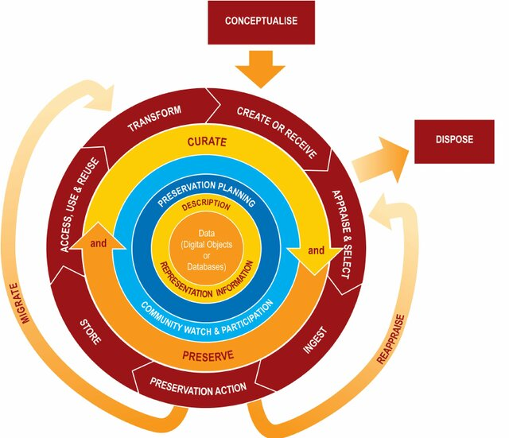
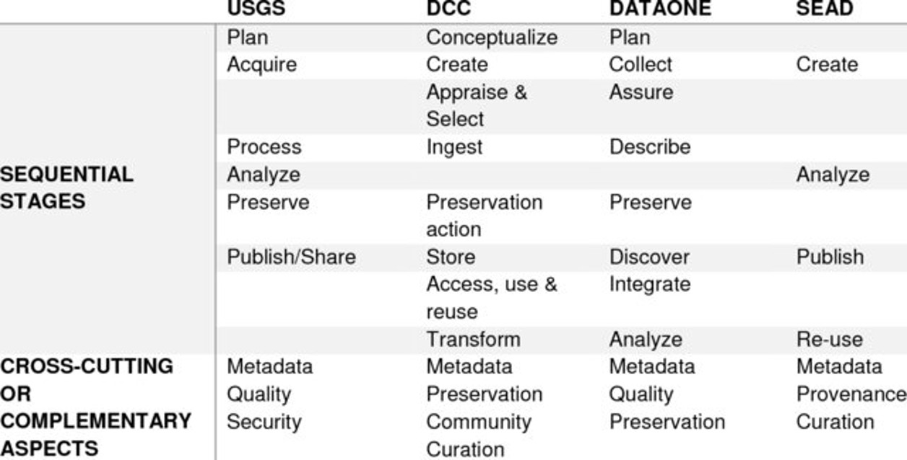

# Data Life Cycle and Data Management {#lifecycle}
## Data Lifecycle {#lifecycle1}
\
**Data management** is the term used to describe the collective tasks to insure the long term archiving of and continuing access to data, including backups, contingency planning, process resumption planning, hardware and network redundancy, automatic failover, and site mirroring [21].

Today, data is collected from many different sources, and is used to improve understanding of emerging situations across different fields [38]. Properly developed data lifecycle helps to study past events, explain current situations, and successfully predict future outcomes. Models that describe data objects through a set of time-ordered stages are called **lifecycle models** [38]. Many of these models exist for different industries and research areas [39], but they all have a similar goal. Their very purpose is to help organizations manage data properly by creating a framework for documenting, protecting, and providing access to important data.

## Data Lifecycle Model {#lifecycle2}


{width="40%" fig-align="center"}


One of the most widely used data lifecycle models was developed by Digital Curation Centre (DCC) [@misc{DCCDMP]. The **DCC Curation Lifecycle Model** explains how data is managed, preserved, and reused over time. This model primarily targets employees of various organizations -- from research institutes to private business and governmental companies, but we are sure its main concepts can be as useful for professionals regardless of their field, including those working individually. Its proposed stages are described below.

All data-related actions included into the DCC Digital Asset Lifecycle Model can be separated into three main categories: full lifecycle actions, used to create and preserve new data, sequential actions, aimed at its maintenance and storage, and occasional actions, required for some only. 

### Full Lifecycle Actions {#lifecycle21}

- *Description and Representation Information.* Metadata and corresponding representation information should be timely added to describe all digital materials (read more about metadata see @lifecycle431)

- *Preservation Planning.* As context, relevancy and other properties associated with data are changing throughout the curation lifecycle, it’s important to develop plans for all curation lifecycle actions.

- *Community Watch and Participation.* When working in a team or organization, development of shared standards, tools and suitable software for data curation can be vital. Data should stay accessible, understandable, and usable over time.

- *Curate and Preserve.* The structure, meaning, and context of the data should not only be clearly documented, but as well preserved at each stage of the cycle, so future users can understand it correctly.

### Sequential Actions {#lifecycle22}

- *Conceptualize.* Before creating or gathering data, a clear plan should be developed: what kind of data is required and in what quantities? How to capture it, and how it should be stored? The answer to one question can directly affect others, as described in the previous chapters.
Create or Receive. When creating data, administrative, descriptive, structural, technical, and preservation metadata can all be of great use. Always mind collecting policies (usually documented) and other ethical restrictions when choosing data capturing methods and sources.

- *Appraise and Select.* Evaluate data, to define which information requires long-term preservation. Therefore, always follow documented guidance and other relevant instructions.
Ingest. Never overlook this step, as timely transferring data to an archive, repository, or a responsible colleague at appropriate steps of the lifecycle often becomes a make-or-break point of it. At this stage, one must again consider the organization’s policies and/or legal requirements.

- *Preservation Actions.* So, what are the possible actions to ensure long-term preservation and retention of data? These are any measures to keep the data authentic, reliable, usable, and complete. It is important to plan such measures not only for today, but also for the future. One of the good examples of future risks would be outdated file formats: before storing valuable information in a particular format, one should first ask themselves, how long this data should be available? Who will be using it next, and will those people have necessary hard- and software to read the format properly? When not, what could be done, and when, to adjust the old data to the new technical requirements? Other crucial steps might include data cleaning, evaluation, assigning preservation metadata, and many more, depending on the nature of information being preserved.

- *Store.* It is important to familiarize yourself with up-to-date standards of data storage and try to adhere to them when storing data. Possible negative scenarios and appropriate solutions should, as always, be considered ahead: damaged paper or digital archives, forgotten passwords, and even fire at a data center are more common obstacles than most people can imagine, and preventing them costs less effort and money than trying to solve those problems.

- *Access, Use and Reuse.* Before making decisions, one should regularly consider the needs of the future users – and re-users of data. On one hand, it is critically important to protect information from any inappropriate usage by unauthorized persons and third parties: authentication procedures and other methods of access control can be truly useful here. On the other hand, as anyone is expected to reuse the data, the solution must be found to provide those people with sufficient access to the required files – for instance, as publicly available information.  

- *Transform.* As explained above, sometimes migration of data into a different format is necessary with time – a complex, but vital task for an organization. This would mean, in fact, creating new data from the original, or transforming it. Another example would be creating a subset of original datasets, by selection or query, to create newly derived results, perhaps for publication : a valid method, that can sometimes can tricky (more about it in the Chapter ).

### Occasional Actions {#lifecycle2}

- *Dispose*. Rely on documented policies, legal requirements, and other pre-made instructions that exist in the organization and, if necessary, the country, to determine how long every data object is supposed to be stored. Data that is no longer useful can be destroyed, sometimes this should be done securely – there are strict legal requirements regarding the destruction of certain data types, explained in detail in chapter X. In large organizations, data may be transferred to another archive, repository, data centre, or a custodian instead. 

- *Reappraise.* When data fails validation procedures, it should be returned for further appraisal and reselection.

- *Migrate*. As previously described above, transferring data into a new format might sometimes be necessary to match the storage environment, or to ensure that the information is still available for the future users possessing the latest technical capabilities.

**Self-Study Questions**

1.	*How relevant is the model to various data professionals: data creators, archivists, or simply those who would like to re-use others’ data? How could you apply the model to your own tasks?*
2.	*What are the types of actions the model discloses, and what is the difference between them? Which of these actions you think might be useful for your current projects?*
3.	*What problems could occur if digital data is stored without consideration of file formats? Can you think of an example where data collected today could still be useful many years later?* 
4.	*What documented instructions or guidelines are used in your organizations for data curation and maintenance? What do you know about the legal requirements of the country / the EU?*
5.	*Reflect on the problems you have previously faced when working with data. Could some of the actions proposed in the model help to overcome any of these obstacles?*

**Exercises**

```{r quiz1-setup, include = FALSE}
library(exams)
library(exams2forms)

exercise_directory <- file.path("exams", "exercises")
quiz_lifecycle_model <- list(
  file.path(exercise_directory, "model-purp.Rmd"),
  file.path(exercise_directory, "why-meta.Rmd"),
  file.path(exercise_directory, "preserve-stage.Rmd"),
  file.path(exercise_directory, "format-outdate.Rmd"),
  file.path(exercise_directory, "docu-data.Rmd"),
  file.path(exercise_directory, "usable-data.Rmd"),
  file.path(exercise_directory, "descr-repr.Rmd"),
  file.path(exercise_directory, "comm-part.Rmd"),
  file.path(exercise_directory, "migration.Rmd"),
  file.path(exercise_directory, "delete.Rmd")
)
```
```{r quiz1, echo = FALSE, message = FALSE, results = "asis"} 
exams2forms(quiz_lifecycle_model, solution = TRUE)
```


## Data Management Plans {#lifecycle3}

A **Data Management Plan (DMP)** is a structured document that describes how research data will be handled throughout the entire data lifecycle - from the moment data are created or collected until they are archived, shared, or destroyed. This term is closely related to the concept of data lifecycle, since the purpose of a DMP is to ensure that data are properly organized, documented, stored, preserved, and made accessible in accordance with scientific, legal, and ethical standards – or, in other words, that the data is appropriately used at each stage of its lifecycle [39][80].

In recent years, DMPs have become a standard requirement for many research funders and institutions. Funding organizations such as the European Commission and the National Science Foundation require researchers to submit a DMP when applying for grants [41][42][40]. These policies are meant to ensure transparency, reproducibility, and responsible data stewardship in modern research. A well-prepared DMP helps researchers foresee potential issues related to every stage of the data lifecycle before the project begins [40].

Although the exact format may vary between institutions or funding programs, most DMPs address several common aspects of data management. Most of these components, as well as the implementation of a DMP in general, can also be truly helpful not only for young scientists, but for all working professionals from various fields, as well as students at any stage of their education paths [80].

The main components of a data management plan include [80]:	

- *Statement of purpose* clarifies the aim of a data gathering: what is the research question (or a business goal), that can be answered with the help of the certain dataset?

- *Data definitions:* users should precisely describe what kinds of data will be collected (e.g., numerical datasets, images, interviews) and specify the file formats that will be used. 

- *Choosing right formats,* as been properly explained in the previous section, can significantly increase usability of the data, while adding metadata can also assist the interpretability of information in the future.

- *Data collection and access*: This section of a DMP highlights how data will be collected, stored, and accessed from a data repository. It will likely address the data sources, the methods used to collect it, as well as how long it will be stored and who will have access to it. Many legal restrictions surround the topic of so-called sensitive data that may be required for a project, and the measures to meet those requirements should be planned beforehand (more about it in the “Ethics” section).

- *Frequently Asked Questions:* Any other considerations regarding data management fall into this category. These might include citation preferences, data backup methods, DOIs used in the database, and so on. 

- *Research data limitations:* The last component refers to the limitations of the data itself. For instance, if the dataset consists of information on only one demographic group, it should be clearly highlighted in this last section, as such frames can seriously affect the re-use of the gathered data.

Several tools have been developed to assist researchers in creating data management plans. Two widely used platforms are DMPonline and DMPTool, which provide templates, guidance, and funder-specific requirements to help researchers prepare their plans efficiently [40].

Developing a DMP early in the research process not only helps satisfy funder requirements but also promotes better data organization, increased reproducibility, and greater opportunities for future data reuse – oftentimes regardless of the nature of the project [43].

**Exercises**
```{r quiz2-setup, include = FALSE}
library(exams)
library(exams2forms)

exercise_directory <- file.path("exams", "exercises")
quiz_dmp <- list(
  file.path(exercise_directory, "dmp-goal.Rmd"),
  file.path(exercise_directory, "dmp-research.Rmd"),
  file.path(exercise_directory, "state-purp-dmp.Rmd"),
  file.path(exercise_directory, "data-def.Rmd"),
  file.path(exercise_directory, "metadata-perk.Rmd"),
  file.path(exercise_directory, "coll-acc.Rmd"),
  file.path(exercise_directory, "dmp-sens.Rmd"),
  file.path(exercise_directory, "dmp-faq.Rmd"),
  file.path(exercise_directory, "data-lim.Rmd"),
  file.path(exercise_directory, "dmp-sw.Rmd")
)
```
```{r quiz2, echo = FALSE, message = FALSE, results = "asis"}
exams2forms(quiz_dmp, solution = TRUE)
```
## Data Lifecycle Actions {#lifecycle4}

As has been mentioned in the previous chapter, there is a plethora of data lifecycle models developed by various organizations for different fields.


{width="60%" fig-align="center"}


Instead of trying to name one universally good model that would be a ready-to-use blueprint for every business, field of study and research task, one should aim at developing a customized model that would suit their organization or project goals best, using any, or all of the described pipelines rather as a checklist for the measures to implement in their particular case. However, as many of the data-related actions are described consistently in most popular models, we are going to provide a more detailed clarification of these proposed processes, most of which will likely be useful for professionals working with data at some stage of their projects.

### Data Creation and Acquirement {#lifecycle41}

Data creation, collection, or acquirement is normally the first stage of the data lifecycle, unless planning of this process is treated as a separate pre-stage in the model. At this step, information relevant to a research question or problem is obtained. Data can originate from first-hand sources (e.g. street interviews, experiments conducted by the user themselves, etc.) -- in this case, it's called **primary data**; and data collected and shared by other users (e.g. research literature), or **secondary data**[5]. Both types of data have their own perks and disadvantages, and in both cases the nature of the data determines the methods suitable for its creation. 

Primary data collection, when done right, can achieve high quality and reliability of data, as is normally more appropriate for the goals of certain research compared to secondary data, which is typically collected by other specialists, with different goals in mind. The drawbacks of primary data collection include high monetary and time costs, poor access to the data, and opportunities for only very niche research. The variety of methods used to collect such data includes questionnaires and surveys, individual and focus-group interviews (which can be free form, structured and semi-structured), observations, case studies, experiments, diaries and memo motion studies, activity sampling techniques, process and link analysis, as well as statistical method.[3]

Secondary data collection, in its turn, can be used to generate new insights from previously collected data, contributing to the quality of other groups‘ research and expanding its scope. Secondary data comes with many other advantages, including low costs, time savings, good accessibility and, potentially, breadth of research, as it it useful to compare the data from different sources, gathered in different settings throughout the time. The drawbacks of this approach may include lack of control over data quality and, as previously described, lack of relevance to the goals of particular research (e.g. the data previously gathered for entire country may not reflect the patterns typical for one of its regions, or data gathered ten years ago might prove to be hopelessly dated, especially in emerging fields)[5]. Secondary data collection methods include, but not limited to, published printed sources, books, journals and periodicals, magazines and newspapers, e-sources of various kinds, general websites, weblogs, government records, census data and population statistics, public sector records. As we have seen, at the data collection stage, researchers must carefully define what type of data is required based on their goals and research question, as the capturing methods will highly depend on the nature of data itself [1][2].

Data creation is not limited to its collection, but can also include actual generation of it. Such data is called **synthetic data**, and can be used as an alternative to the real-world data. The need for it is motivated by data scarcity, privacy concerns [7], and algorithmic biases. Synthetic data preserve all underlying trends of the original dataset, all the while providing new content, also in large quantities, when it’s necessary [6]. The methods used to generate synthetic data may include large language models (LLMs), generative adversarial networks (GANs) and variational autoencoders (VAEs). Since generating data synthetically is a complex skill on its own and honing it may go beyond the scope of your research, there are easier ways to obtain data for its purposes (e.g. using toy datasets, data stored in artificial benchmark models, etc.). Performance of data generation techniques over various dimensions (based on systematic literature review by [6])
 
Performance of data generation techniques over various dimensions (based on systematic literature review by [6])

**Reflection Questions**

1.	*Why is the planning stage sometimes comes before the data creation stage in data lifecycle models? What should one decide on before collecting the data?*
2.	*What advantages do primary data have compared to secondary data? Which type do you normally use in your work? Which methods have you personally used to collect it?*
3.	*What limitations might occur when relying on secondary datasets?*
4.	*In what situations might synthetic data be preferable to real-world data, and how to generate it?*
5.  *Go to (<https://www.researchgate.net/>) or (<https://www.scopus.com/>) and find there five most cited papers in your field of study. Name the methods used for each research. Why do you think the authors opted for them?*

**Exercises**
```{r quiz3-setup, include = FALSE}
library(exams)
library(exams2forms)

exercise_directory <- file.path("exams", "exercises")
quiz_lc_actions <- list(
  file.path(exercise_directory, "ex1-lc.Rmd"),
  file.path(exercise_directory, "quali-data.Rmd"),
  file.path(exercise_directory, "ordinal-data.Rmd"),
  file.path(exercise_directory, "discrete-data.Rmd"),
  file.path(exercise_directory, "primary-data.Rmd"),
  file.path(exercise_directory, "gov-second.Rmd"),
  file.path(exercise_directory, "contin-range.Rmd"),
  file.path(exercise_directory, "qual-method.Rmd"),
  file.path(exercise_directory, "synth-data.Rmd"),
  file.path(exercise_directory, "collect-relevance.Rmd")
)
```
```{r quiz3, echo = FALSE, message = FALSE, results = "asis"} 
exams2forms(quiz_lc_actions, solution = TRUE)
```


### Data Processing and Cleaning {#lifecycle42}

After data has been properly created, it is then to be processed. Unfortunately, data rarely exists in a form that makes it ready for analysis instantly. Raw datasets often contain inconsistencies, missing values, formatting issues, duplicate records, and other problematic entries that, when left unfixed, can result in serious distortion in the final analysis and, sometimes, lead one to completely false conclusions [45] (more practical attitude to the topic of data processing and cleaning is covered in Chapter 5). Data processing and cleaning therefore represent an essential stage of the data lifecycle, ensuring that data is *reliable, consistent, and suitable for further analysis and interpretation*.

**Data processing** refers to the set of activities that transform raw data into a structured and usable format. These activities can include organizing data, correcting errors, converting formats, and integrating information from multiple sources. One major component of data processing is data **cleaning,** which focuses on identifying and correcting problems in datasets. Common issues include missing values, duplicate entries, inconsistent labels, and incorrect measurements. Researchers must decide how to address these problems depending on the nature of the dataset and the research objectives. For example, missing values may be removed, replaced with estimated values, or analyzed separately if they carry meaningful information. Removing duplicates is also crucial when multiple records refer to the same observation, as duplicates can bias statistical results [45].

Another important aspect of data processing is **data transformation,** which involves converting data into a consistent structure or format [46]. This may include standardizing measurement units, converting file formats, or restructuring datasets into tabular or database formats suitable for analysis tools. For example, textual responses from surveys may need to be categorized or coded before they can be analyzed statistically. Similarly, date and time formats often need to be standardized to ensure compatibility across systems.

Closely related to transformation is **data normalization,** which refers to adjusting data values to a common scale or structure. In statistics and machine learning, normalization may involve scaling numerical values to a particular range (for example between 0 and 1), which allows algorithms to compare variables more effectively. In database systems, normalization also refers to structuring data in a way that reduces redundancy and improves integrity [47].

Data processing frequently also involves **data integration,** which combines data from different sources into a single unified dataset. This process is common in interdisciplinary research, where datasets may originate from multiple laboratories, institutions, or measurement systems. Integrating such data requires careful harmonization of formats, units, and metadata to ensure that the combined dataset remains meaningful and consistent [46].

In many professional and research environments, these tasks are implemented through ETL pipelines - *Extract, Transform, Load* workflows. In this process, data are first extracted from their original sources, then transformed through cleaning and processing steps, and finally loaded into a database or data warehouse where they can be analyzed or shared. ETL pipelines help automate repetitive tasks and ensure that data processing steps are reproducible and transparent [47]

Despite this stage often being time-consuming and tiresome, it is also one of the most rewarding. A well-processed dataset is the cornerstone of any accurate analysis, which makes final conclusions truly reliable, and results more suitable for re-use in future studies [45][46]. Any problematic entries, on the other hand, often tend to propagate further, and make one return to the cleaning stage once again.

**Reflection Questions**

1.	*Why do you think raw data collected during research projects are often not suitable for immediate analysis? Is it possible to gather data that is already “clean” enough to skip cleaning stage?*
2.	*Have you ever had to cleanse data on your own? What methods did you use for each problem?*
3.	*In what situations might removing missing values be problematic?*
4.	*Why is it important to standardize formats (e.g., dates, units of measurement) before analyzing data?*
5.	*How would you spot a secondary dataset, where a cleansing stage was skipped?*

**Exercises**
```{r quiz4-setup, include = FALSE}
library(exams)
library(exams2forms)

exercise_directory <- file.path("exams", "exercises")
quiz_proc_n_clean <- list(
  file.path(exercise_directory, "preproc.Rmd"),
  file.path(exercise_directory, "raw-data.Rmd"),
  file.path(exercise_directory, "data-proc.Rmd"),
  file.path(exercise_directory, "clean-purp.Rmd"),
  file.path(exercise_directory, "miss-vals.Rmd"),
  file.path(exercise_directory, "data-transform.Rmd"),
  file.path(exercise_directory, "normal.Rmd"),
  file.path(exercise_directory, "dat-integrat.Rmd"),
  file.path(exercise_directory, "etl.Rmd"),
  file.path(exercise_directory, "proc-perk.Rmd")
)
```
```{r quiz4, echo = FALSE, message = FALSE, results = "asis"} 
exams2forms(quiz_proc_n_clean, solution = TRUE)
```


### Data Storage and Maintenance {#lifecycle43}

Once the data has been created and cleaned, it then has to be stored and maintained. Data can be stored in databases, data warehouses, or cloud storage systems. Choosing the right option for a particular case depends on balance performance, cost, and scalability [1]. Regular maintenance activities, such as data cleansing and updating, ensure that data remains accurate and relevant. Security measures, including encryption and access controls, are normally implemented to protect data from unauthorized access and breaches. Proper data storage starts with creating contextual metadata.

#### Metadata {#lifecycle431}

Metadata is a key factor for data preservation, for replicating results in the peer review process, for data reuse, and for creating knowledge from data. Well-managed data without metadata could be useless, but reating metadata is a demanding task that is both complex and time-consuming [26]. It can be crucial to decide on which attributes to document, that is what to capture in metadata, and this can be a complex task on its own.[26] 

Within the lifecycle, metadata can be created at virtually any point: prior to data creation, when files are saved, or when submitting to a repository. It is relatively easy to access, create and edit metadata (unless it has been protected by the author), but many data users still overlook this step. What is important to know is that not only careless usage or neglect of metadata can make data hardly comprehensible even for the same user in the future, but also is that anyone the user shares copies of the file with will be able to access all this hidden information. Therefore, one should always review (and adjust, when necessary) the metadata before giving access to the files to anybody. If necessary, some of the existing metadata should be timely deleted. This can be crucially important, as metadata may contain confidential information about the authors, the institution or company the authors are working for, etc., which should not be shared with the third parties. *Metadata that get into wrong hands can jeopardize both one’s business interests and personal security* – especially if Personally identifiable information (PII), which can be easily obtained from metadata, will be used in unethical ways (read more about sensitive information in @ethics52 ). By abusing sensitive information from metadata, one can: 

-   create detailed digital profiles of individuals and gather information of their activities online (z.B. for marketing purposes);to trace users back to their social media profiles;

-   access one’s social media channels, create fake profiles and secretly use them for criminal purposes;

-   in business context, transmitting internal company metadata makes companies vulnerable to targeted attacks;

-   in research field, loss of metadata can sometimes lead to the leak of participants’ sensitive data or the loss of valuable research results..

At the same time, hidden data or outdated comments could mislead the recipient, or even the user themselves as time passes and the properties and details of the data, which seemed obvious back then, might be easily forgotten. Therefore, not using metadata properly and timely can significantly decrease the usability of the data and make access to it more complicated. Therefore, not only teams, but also professionals and students working on their own should be as mindful about using metadata for their projects: even if one is not going to share the data with anybody else, overtime their notes and comments will prove exceptionally helpful in any data-related work.

#### Formats {#lifecycle435}

Any data, be it numeric, text-based, audio, video, or still images, is always represented in a certain format. In this context, a **format** is defined as “the internal structure and encoding of a digital object, which allows it to be processed, or to be rendered in a human-accessible form” [21] (for the other definition of formats, check subchapter 5 "Data Formats). As the representation of data, format becomes an antecedent to preservation by providing the knowledge of the data itself. Reading, rendering, and processing the data requires knowledge and understanding of the format. Changes to the format or the environment can make the underlying data unrecognizable and unusable. Effective data reuse, and ultimately the ability to preserve data, depends on standard data formats and tool sets to build, read and manage the data. *Preservation technologies* refers to all of the technical infrastructures to support data collections.

Central to any preservation infrastructure is a physical repository, be it a simple data store for datasets, or a whole system designed as an archive for digital data with context, fixity, persistence, and access. Repositories provide services to ensure the long term archiving of and continuing access to data including backups, contingency planning, process resumption planning, hardware and network redundancy, automatic failover, and site mirroring. Repository services increase in importance as the amount of data grows.

Data management, contextual metadata, formats, and preservation technologies can also be barriers that prevent preservation. For example, data management is expensive in terms of both personnel and equipment, and many scientist avoid honing their skills in this domain to focus on their studies instead, which complicates their research in the end.


**Exercises**
```{r quiz5-setup, include = FALSE}
library(exams)
library(exams2forms)

exercise_directory <- file.path("exams", "exercises")
quiz_metadata <- list(
  file.path(exercise_directory, "meta-basics.Rmd"),
  file.path(exercise_directory, "meta-help.Rmd"),
  file.path(exercise_directory, "maint.Rmd"),
  file.path(exercise_directory, "encr-sec.Rmd"),
  file.path(exercise_directory, "repo.Rmd"),
  file.path(exercise_directory, "dataset-context.Rmd"),
  file.path(exercise_directory, "backup-risk.Rmd"),
  file.path(exercise_directory, "local-control.Rmd"),
  file.path(exercise_directory, "integrity.Rmd"),
  file.path(exercise_directory, "stor-monitor.Rmd")
)
```
```{r quiz5, echo = FALSE, message = FALSE, results = "asis"} 
exams2forms(quiz_metadata, solution = TRUE)
```


#### Relational Databases {#lifecycle432}

A **relational database** is a tool that organizes data into structured tables, where each table consists of rows and columns. This model is based on the relational (describing not only the objects, but also relations between them at the same time) model, first proposed by Edgar F. Codd in 1970. Nowadays, this relational database model remains one of the most widely used approaches for storing and managing data in both research and industry [61].
 
In a relational database, each table represents a specific entity (e.g., students, courses, experiments), and each row (tuple) represents a single record. Columns (attributes) define the properties of that entity, such as name, age, or ID. A key feature of relational databases is the use of keys to uniquely identify and link data across tables – this is how relations are precisely described in this system. A **primary key** uniquely identifies each record within a table, while a **foreign key** establishes relationships between tables by referencing a unique key in another table [62]. The difference between primary key and unique key is that the latter just has the property of uniqueness, and primary key, while being unique as well, won't take null values.

Relational databases rely on *Structured Query Language (SQL)* for data manipulation and retrieval. SQL allows users to perform operations such as querying data, inserting new records, updating existing entries, and deleting data. It also supports complex operations such as joins, which combine data from multiple tables based on their relationships [63].

A central concept in relational databases is **data integrity,** which ensures that data remain accurate, consistent, and reliable. Integrity is maintained through constraints such as:

-   primary key constraints (unique identification of records)
-   foreign key constraints (valid relationships between tables)
    domain constraints (valid data types and ranges)
-   NOT NULL constraints (mandatory values)

These mechanisms help to prevent errors such as duplicate records, invalid references, and missing mandatory values. This significantly improves overall data quality and reduces the need for data cleansing a crucial step in data lifecycle describe previously in detail [62][64].

Another important principle is **normalization,** which is the process of organizing data to reduce redundancy and improve consistency. Normalization divides data into multiple related tables, minimizing duplication and ensuring that updates are applied consistently. Common normal forms (e.g., First Normal Form, Second Normal Form, Third Normal Form) define rules for structuring data effectively [64].

Relational databases are widely used because they provide strong consistency, structured organization, and powerful querying capabilities. They are particularly suitable for situations when data relationships are well-defined (structured data) and data integrity is critical, such as financial systems, administrative databases, and scientific research datasets [61][63].
However, relational databases may face limitations when dealing with very large volumes of unstructured data or highly flexible data models. In such cases, alternative systems such as NoSQL databases or data lakes may be more appropriate. Despite these limitations, relational databases are widely used for data management systems for a reason: compared to other existing solutions, they provide a highly reliable and structured data storage [63][64].

**Reflection Questions**

1.	*Why are relational databases structured into tables instead of storing all data in one place?*
2.	*What advantages do primary and foreign keys provide?*
3.	*Why is normalization important for data consistency?*
4.	*In what situations might relational databases not be the best choice?*
5.	*How does SQL make working with relational databases easier?*

**Exercises**
```{r quiz6-setup, include = FALSE}
library(exams)
library(exams2forms)

exercise_directory <- file.path("exams", "exercises")
quiz_db <- list(
  file.path(exercise_directory, "rel-db.Rmd"),
  file.path(exercise_directory, "rel-mod.Rmd"),
  file.path(exercise_directory, "prim-key.Rmd"),
  file.path(exercise_directory, "for-key.Rmd"),
  file.path(exercise_directory, "sql-db.Rmd"),
  file.path(exercise_directory, "sql-sel.Rmd"),
  file.path(exercise_directory, "norm-db.Rmd"),
  file.path(exercise_directory, "not-null.Rmd"),
  file.path(exercise_directory, "row-db.Rmd"),
  file.path(exercise_directory, "db-use.Rmd")
)
```
```{r quiz6, echo = FALSE, message = FALSE, results = "asis"} 
exams2forms(quiz_db, solution = TRUE)
```
#### Data Lakes {#lifecycle433}

A **data lake** is a type of storage system that allows organizations to keep large amounts of data in one place. One important difference compared to traditional databases or data warehouses is that *data lakes do not always require the data to have a fixed structure before storing it:* instead, data stored in a data lake can be more or less structured, or even have no traditional structure at all (also called natural, or raw format) [47]. Here, under structured data we assume tabular form data, like a relational database (fully structured) or, for instance, in a csv file (semi-structured) (more about structure and dimensionality of data in the Introduction chapter). Binary data, like images or audio files, can also be safely stored in a data lake. Because of this, data lakes can be truly useful in modern environments where data can come from many different sources, for example sensors, social media platforms, multimedia files, etc. [49][47].

The idea of data lakes became more popular because traditional data warehouses often require data to be cleaned and transformed before it is stored. This approach is called **schema-on-write,** since the structure of the data has to be defined early. In data lakes, the process can be totally different. Data are usually stored first in their original format, and the schema is applied later when the data are analyzed. This approach is known as **schema-on-read** and gives more flexibility for different types of analysis, especially in big data analytics and machine learning applications, [50] and also when the amounts of data is exceptionally large.

Data lakes are commonly built using scalable technologies such as distributed storage systems or cloud platforms. Earlier systems often used Hadoop Distributed File System (HDFS), while modern solutions frequently rely on cloud storage services like Amazon S3 or Azure Data Lake Storage. These technologies make it possible to store very large amounts of data with relatively low cost and good scalability [47][50].

Another advantage of data lakes is that they can provide more opportunities for analytics. The inevitable drawback of traditional warehouses is the need to preprocess and structure data in a certain way before it can be saved. It provides consistence and robustness, but not flexibility. Instead, in datalakes original data can be preserved in a detailed form, which provides more options for analysis [50]. Therefore, in warehouses data is often suitable only for specific analytical goals, while data from datalakes can sometimes provide more insight due to its fullness.

At the same time, data lakes also have some disadvantages. If they are not managed correctly, they can become what is sometimes called a **“data swamp”** – an unorganized “pile” of data, which is often difficult to find, and sometimes completely unreliable. Here, again, data management plans can prove to be useful, as adding and updating metadata, regular monitoring of data quality and similar procedures are especially important when working with such diverse and differently structured data [49]

Security is also an important issue. Since data lakes may contain sometimes large volumes of raw and sensitive data, using suitable protection mechanisms would be crucial to prevent unauthorized access and potential abuse of the data [47].

**Reflection Questions**

1. *What are the main differences between a data lake and a data warehouse?*
2. *Why can storing data in raw format be useful for future analysis?*
3. *What problems may appear if a data lake is not managed properly?*
4. *How does schema-on-read influence data analysis workflows?*
5. *In which situations would a data lake be more suitable than a relational database or data warehouse?*

**Exercises**
```{r quiz7-setup, include = FALSE}
library(exams)
library(exams2forms)

exercise_directory <- file.path("exams", "exercises")
quiz_lakes <- list(
  file.path(exercise_directory, "lake-base.Rmd"),
  file.path(exercise_directory, "lake-types.Rmd"),
  file.path(exercise_directory, "sch-read.Rmd"),
  file.path(exercise_directory, "sch-write.Rmd"),
  file.path(exercise_directory, "hdfs.Rmd"),
  file.path(exercise_directory, "swamp.Rmd"),
  file.path(exercise_directory, "lakes-ml.Rmd"),
  file.path(exercise_directory, "lakes-prob.Rmd"),
  file.path(exercise_directory, "lakehouse.Rmd"),
  file.path(exercise_directory, "lake-meta.Rmd")
)
```
```{r quiz7, echo = FALSE, message = FALSE, results = "asis"} 
exams2forms(quiz_lakes, solution = TRUE)
```

#### Associated Challenges {#lifecycle434}

Data storage becomes a more challenging task every year, as organizations generate more data than ever, and large data volumes increase storage needs. Besides, diverse data types make management harder. As the result, existing systems can become overloaded. Therefore, scalable storage solutions are oftentimes used where it is necessary to reduce pressure, while big data analytics supports handling complexity.

Another challenge is complex rules govern data retention, privacy, and security (more on this topic in Data Ethics section). Organizations and researchers must manage strict requirements for storing, accessing, and disposing of data, and non-compliance leads to high fines and reputational damage. Modern technologies, though, provide new solutions for the above mentioned issues: AI and ML can automate data classification and improve organization, while blockchain ensures integrity with immutable records. Unfortunately, integrating new technologies is difficult and costly, since organizations need updated infrastructure and skilled staff to use the modern solutions properly. [1]


### Data Archiving and Retention {#lifecycle45}

Long-term preservation ensures that research data remain available beyond the duration of a project. Many institutions require research data to be retained for at least 10 years to ensure reproducibility and accountability [13].

**Retention policies** define how long different categories of data should be preserved and when they may be archived or deleted. The Alliance of Science Organisations in Germany voiced its support for the long-term archiving of research data, open access to it and compliance with the conventions of individual disciplines in the "Principles for the Handling of Research Data", adopted in 2010.

The general guidelines for researchers include [22]:

-   *Project planning and submission of proposals* means to consider during the planning stage whether and how much of the research data resulting from a project could be relevant for other research contexts and how this data can be made available to other researchers for reuse. The relevant explanations must contain information about data types, discipline-specific standards (if applicable) and the choice of suitable repositories, if these are available for a given research area or particular data types. Details should also be provided on any third-party rights affected and preliminary planning for the data publication schedule.

-  *Accessibility.* Assuming that the publication of research data from your project does not conflict with the rights of third parties (in particular data protection or copyright), research data should be made available as soon as possible. Data should be made accessible at a stage of processing that allows it to be usefully reused by third parties (raw data or structured data). To make sure this is the case, it must be ensured that access to the data is still guaranteed when, through publication, the rights of use relating to research data are transferred to a third party, usually a publishing house.

-   *Long-term archiving*. In accordance with the rules of good scientific practice, research data should be archived in the researcher's own institution or an appropriate nationwide infrastructure for at least 10 years.

Retention policies must be translated into practical schedules: each data type gets a defined retention timeline:

1. Classify data according to categories
2. Use automated tools to tag and organize data
3. Define how long each category must be kept
4. Consider legal requirements and needs of your research

Data governance platforms support retention management, while content management systems and cloud solutions include retention feature. Many tools offer automated workflows, audit trails, and reports. **Audits** verify that retention policies are followed. They check if data is stored, deleted, or archived as scheduled. Audits reveal gaps, errors, and failed processes. They also ensure data is correctly classified. 

Retention policies themselves must be reviewed regularly, too. Regulations change and can affect retention requirements. Reviews keep policies aligned with legal and operational needs. If working on a group project, always communicate updates to the other participants

### Data Destruction {#lifecycle45}

It is important to remember, that *simple deletion of data is not enough.* When a file is deleted using the usual methods inherent in an operating system, these methods typically only remove the pointers to the files, not the actual files themselves. The data remains on the hard drive as unallocated space and can easily be recovered with readily available tools. Using system utilities and reformatting a hard drive will securely delete all data on the hard drive. Like rm and del, these utilities modify file system attributes but do not remove the actual data.
CD-ROMs, since they are read-only, present a different challenge in that there is no way to programmatically and securely delete the contents of the CD. Inoperable hard drives are also a challenge since they cannot be connected to a system and accessed through software.
Methods of secure deletion may include various techniques, that would also highly depend on the nature of data itself. For example, the so-called **disk wiping** is a term used to describe a method that writes a series of ones and/or zeros over the disk to securely remove the data. Since tools that do this have to overwrite the entire disk, this process can be time-consuming. On the other hand, for media that has contained highly sensitive data or for media that cannot be wiped (for example, inoperable hard drives or DVDs) or degaussed (for example, CD-ROMs), destruction of the media is the most effective means of ensuring that the data cannot be recovered. In order to be effective, the destruction has to be thorough. For example, a simple whack with a hammer leaves the majority of data on the media readable. For detailed guidelines for inoperable devices, see "About disposing of failed devices and media containing data" [81], but more important is to check on the organization’s documented policies and governmental regulations of respective country (more about some of these legal restrictions in chapter @ethics). 

Another way to properly delete the unwanted data is called **degaussing:** it is a process by which magnetic storage media is subjected to a powerful magnetic field to remove data on the media. It is appropriate for magnetic tape, but is ineffective with optical media such as DVDs and CDs. Information classified as Critical data, when stored in paper form, must be properly destroyed by shredding. For low-volume paper document destruction, units may consider purchasing a small cross-cut paper shredder. For high volume needs, a document destruction vendor may be the best solution. 


## Popular Data Management Software {#lifecycle5}


Nowadays, many of the tasks data managers are working on can be safely delegated to reliable software. These tools support different stages of the data lifecycle and are designed for users with varying levels of technical expertise. Popular data management software can be broadly categorized into business intelligence (BI) tools, database management systems, data processing platforms, and visualization tools [49][47].

One widely used category is **business intelligence (BI)** software, which enables users to transform raw data into meaningful insights through dashboards, reports, and visualizations. Tools such as Microsoft Power BI, Tableau, and Qlik Sense allow users to connect to multiple data sources, perform basic data transformations, and create interactive visualizations. These tools are particularly valuable for decision-making, as they allow professionals not seasoned in tech tasks to explore and interpret data "intuitively" [65].

Another important category is **database management systems (DBMS),** which are used to store and organize structured data (see @lifecycle432 ). Examples include MySQL, PostgreSQL, and Oracle Database. These systems support efficient data storage, retrieval, and manipulation using query languages, typically SQL. They also enforce data integrity through constraints and support multi-user environments, making them essential for enterprise applications [63].

For large-scale data processing, organizations often rely on **big data platforms** such as Apache Hadoop and Apache Spark. These frameworks are designed to process massive datasets across distributed computing environments. They enable tasks such as batch processing, real-time analytics, and machine learning, which are not feasible with traditional database systems alone [47].

Besides, many organizations use data integration and previously mentioned **ETL tools** to manage data workflows. Tools like Talend and Informatica PowerCenter can help to extract data from multiple sources, transform it into consistent format, and load it to storage systems such as data warehouses or data lakes (see @lifecycle433). These tools improve data quality and ensure that data is ready for analysis [49].

**Cloud-based platforms** are another widely used tool in data management. Services such as Google BigQuery and Amazon Redshift provide handy opportunitites for storing and analyzing large datasets without requiring highly performative hardware. These platforms offer great performance, flexibility, and integration with other cloud services [47].

Overall, all of the above mentioned options have their own advantages, which make them suitable for different kinds of data management tasks. choosing the right combination of tools depends on factors such as data volume, complexity, required analytics capabilities, and user expertise [49][65], but most of the solutions mentioned in this category are confidently and successfully used also among professionals who do not have a solid background in data science.

**Reflection Questions**

1.	*What are the main differences between BI tools and database systems?*
2.	*Why are visualization tools important for decision-making?*
3.	*What advantages do cloud-based data platforms offer compared to local systems?*
4.	*In what situations would you use a big data platform instead of a traditional database?*
5.	*How do ETL tools improve data quality?*

**Exercises**
```{r quiz8-setup, include = FALSE}
library(exams)
library(exams2forms)

exercise_directory <- file.path("exams", "exercises")
quiz_dm_software <- list(
  file.path(exercise_directory, "bi-purp.Rmd"),
  file.path(exercise_directory, "bi-tool.Rmd"),
  file.path(exercise_directory, "dbms.Rmd"),
  file.path(exercise_directory, "pg-sql.Rmd"),
  file.path(exercise_directory, "apache.Rmd"),
  file.path(exercise_directory, "etl-sw.Rmd"),
  file.path(exercise_directory, "talend.Rmd"),
  file.path(exercise_directory, "cloud-perk.Rmd"),
  file.path(exercise_directory, "big-cl.Rmd"),
  file.path(exercise_directory, "dash.Rmd")
)
```
```{r quiz8, echo = FALSE, message = FALSE, results = "asis"} 
exams2forms(quiz_dm_software, solution = TRUE)
```

